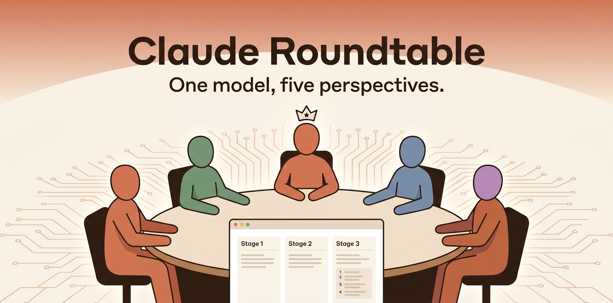

# Claude Roundtable



> This project is a fork of [Andrej Karpathy's `llm-council`](https://github.com/karpathy/llm-council), adapted to use Anthropic's Claude API exclusively (instead of OpenRouter) and rebranded as Claude Roundtable.

The idea of this repo is that instead of asking a single question to a Claude model, you consult a "Roundtable" of advisors, each reasoning from a different, deliberately tension-creating thinking style. This repo is a simple, local web app that essentially looks like ChatGPT except it uses the Anthropic API to send your query to each advisor, it then asks them to review and rank each other's work, and finally a Chairman model produces the final response.

Out of the box, the council has 5 default advisor roles:

1. **The Contrarian** - looks for what's wrong, missing, or likely to fail.
2. **The First Principles Thinker** - strips away assumptions and asks what problem is actually being solved.
3. **The Expansionist** - looks for the upside and adjacent opportunities everyone else is missing.
4. **The Outsider** - has zero context and reacts purely to what's in front of them, catching blind spots experts miss.
5. **The Executor** - only cares whether it can actually be done, and what the fastest first step is.

These 5 are just the starting defaults, not fixed. Click the ⚙ button next to the "Claude Roundtable" title in the sidebar to open **Council Settings**, where you can edit any role's system prompt, Claude model, and effort level, add brand-new members, or delete any role (including the original 5). When you start a new conversation, a picker lets you choose which members of the current roster sit on the council for that conversation - the selection is fixed for the whole conversation, including any follow-up messages.

In a bit more detail, here is what happens when you submit a query:

1. **Stage 1: First opinions**. The user query is given to all 5 advisors individually, and the responses are collected. The individual responses are shown in a "tab view", so that the user can inspect them all one by one.
2. **Stage 2: Review**. Each advisor is given the responses of the others. Under the hood, the advisor identities are anonymized so that they can't play favorites when judging outputs. Each advisor ranks the responses in accuracy and insight, from their own thinking style's perspective.
3. **Stage 3: Final response**. The designated Chairman of the Claude Roundtable takes all of the advisors' responses and compiles them into a single final answer that is presented to the user.

You can keep a conversation going with follow-up questions - each one re-runs the entire 3-stage process above, but with the context of your earlier questions and the Chairman's previous final answers (the advisors' individual opinions and peer rankings from earlier turns aren't replayed, only the final answers, to keep prompts small). Since a follow-up means convening the whole council again rather than a quick incremental reply, the app asks you to confirm before sending one.

Conversations are listed in the sidebar and can be deleted at any time by hovering over one and clicking the "×" button that appears (with a confirmation prompt).

## Vibe Code Alert

This project was 99% vibe coded as a fun Saturday hack because I wanted to explore and evaluate a number of LLMs side by side in the process of [reading books together with LLMs](https://x.com/karpathy/status/1990577951671509438). It's nice and useful to see multiple responses side by side, and also the cross-opinions of all LLMs on each other's outputs. I'm not going to support it in any way, it's provided here as is for other people's inspiration and I don't intend to improve it. Code is ephemeral now and libraries are over, ask your LLM to change it in whatever way you like.

## Setup

### 1. Install Dependencies

The project uses [uv](https://docs.astral.sh/uv/) for project management.

**Backend:**
```bash
uv sync
```

**Frontend:**
```bash
cd frontend
npm install
cd ..
```

### 2. Configure API Key

Create a `.env` file in the project root:

```bash
ANTHROPIC_API_KEY=sk-ant-...
```

Get your API key at [console.anthropic.com](https://console.anthropic.com/). Make sure you have credits available on your account.

### 3. Configure the Council (Optional)

The council roles (system prompt, model, effort) are editable from the app itself via the ⚙ **Council Settings** button in the sidebar - no code changes or restart needed. `backend/config.py` only supplies the *starting* roster the first time the app runs (or after you delete `data/council_roles.json` to start over):

```python
DEFAULT_COUNCIL_ROLES = [
    {"name": "The Contrarian", "system_prompt": "...", "model": "claude-opus-5", "effort": "high"},
    {"name": "The First Principles Thinker", "system_prompt": "...", "model": "claude-opus-5", "effort": "high"},
    {"name": "The Expansionist", "system_prompt": "...", "model": "claude-opus-5", "effort": "high"},
    {"name": "The Outsider", "system_prompt": "...", "model": "claude-opus-5", "effort": "high"},
    {"name": "The Executor", "system_prompt": "...", "model": "claude-opus-5", "effort": "high"},
]

CHAIRMAN_MODEL = "claude-opus-5"
MODEL_EFFORT = "high"
```

The Chairman (the model that synthesizes the final answer) is not part of the editable roster - it stays a plain constant in `config.py`.

## Running the Application

**Option 1: Use the start script**
```bash
./start.sh
```

**Option 2: Run manually**

Terminal 1 (Backend):
```bash
uv run python -m backend.main
```

Terminal 2 (Frontend):
```bash
cd frontend
npm run dev
```

**Option 3: Docker Compose**
```bash
docker compose up --build
```
This builds and runs the backend and frontend in containers, reading `ANTHROPIC_API_KEY` from the `.env` file in the project root. Source files are volume-mounted so changes are picked up without rebuilding.

Then open http://localhost:5173 in your browser.

## Tech Stack

- **Backend:** FastAPI (Python 3.10+), Anthropic Claude API
- **Frontend:** React + Vite, react-markdown for rendering
- **Storage:** JSON files in `data/conversations/` and `data/council_roles.json`
- **Package Management:** uv for Python, npm for JavaScript
- **Containers:** Docker Compose (`backend/Dockerfile`, `frontend/Dockerfile`)
